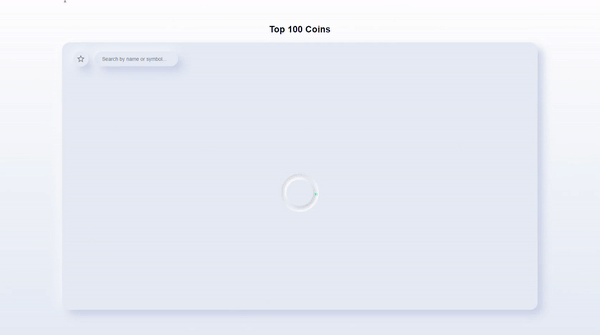

# Top 100 Coins

This project is a Single Page Application showing a **list of the top 100 cryptocurrencies**, powered by Coingecko's API. 

## Features

Using this application, users can:

- save their favorite coins and filter them
- search all coins (or only their favorite ones) by their name or symbol
- sort results by rank, name, symbol, current price, percentage change (24h), total volume, and market cap, both in ascending and descending order
- use the application from any device (responsive)
- use the application offline (although no results will be fetched from the API)

## Stack

- React (core UI/frontend technology)
- Styled-components (style and responsiveness)
- React Hooks (state management and persistence)
- PWA/service worker (offline mode)
- Jest (testing)

## Project Structure and High-level Decisions

The project was built starting from a basic CRA template. I chose React because of its flexibility and its development toolset. 

For the styling, I chose styled-components so that I could handle conditional styling more easily, along with nesting and more. I created a global .css stylesheet for very generic universal issues (like normalization) and a simple theme containing the most repeating properties. Except for the global styles and the theme, all component-specific styling files are inside their relative components' folders.

As for state management, since this is not a big application with many states involved, I chose to use React built-in hooks over libraries such as Redux, which would add a complexity layer that in this case wouldn't be that necessary. Also, the majority of the state is handled by one child component only (`<Table/>`), so props drilling is very contained. To persist state after a refresh, I took advantage of two custom hooks: useSessionStorage and useLocalStorage. I initially started by implementing only the latter, but then I considered it would give a much better UX to use mainly the former and leave the localStorage just to store users' favorites.

## High-level flow

- The `<Main/>` component sets the value of the query and whether users want to see only favorite coins or not.
- The `<CoinsList/>` component fetches all the coins from the API only once on mount and extracts the information/properties needed.
- The `<Table/>` component receives the coins list as props, filters it based on if the user has entered an input in the search bar or toggled to show favorites, then sorts it according to the current order and parameter, and finally paginates the results. It also allows users to update their favorite coins.